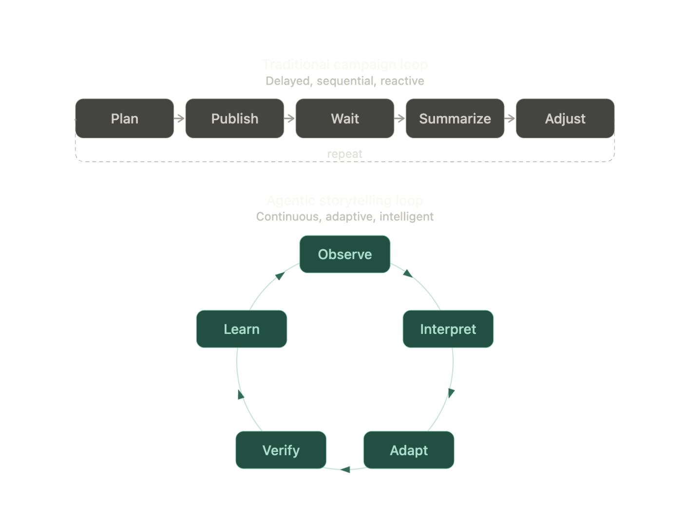

# From Static to Adaptive Narrative

Most campaign systems still run on delayed loops. Agentic storytelling changes the loop entirely.

<figure><figcaption>Traditional campaigns are delayed, sequential, and reactive. Agentic storytelling is continuous, adaptive, and intelligent.</figcaption></figure>

The difference is not only speed. It is **accountability**.

In a healthy adaptive narrative system, participants can see that meaningful actions are noticed, that recognition is not random, and that decisions are traceable.
